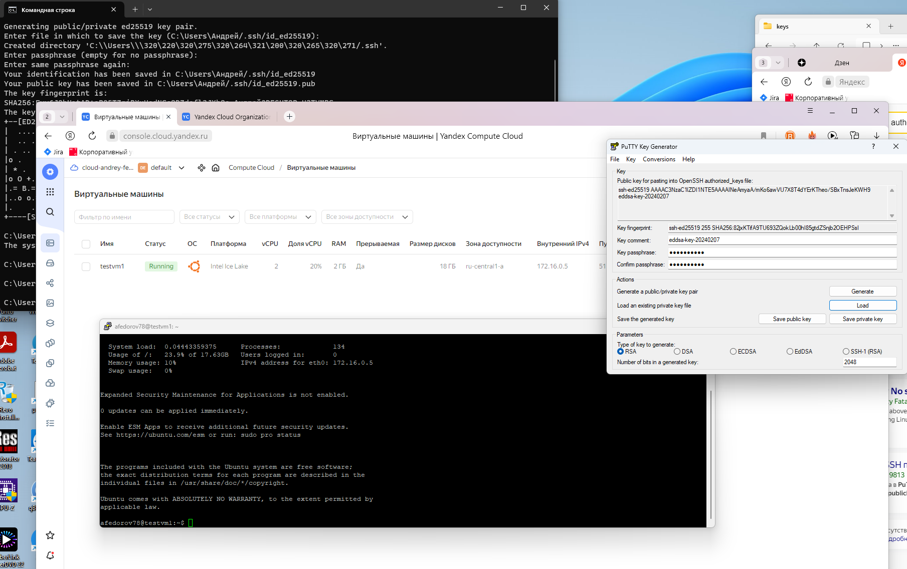

# ДЗ

## ClickHouse

1. Создал Yandex VM




2. ## Установка clickHouse

sudo apt-get install -y apt-transport-https ca-certificates dirmngr

sudo apt-key adv --keyserver hkp://keyserver.ubuntu.com:80 --recv 8919F6BD2B48D754

echo "deb https://packages.clickhouse.com/deb stable main" | sudo tee \
    /etc/apt/sources.list.d/clickhouse.list

sudo apt-get update

Ставим clickHouse<br>
sudo apt-get install -y clickhouse-server clickhouse-client


Старт ClickHouse
sudo service clickhouse-server start

Соединился<br>
afedorov78@testvm1:~$ clickhouse-client
ClickHouse client version 24.1.2.5 (official build).
Connecting to localhost:9000 as user default.
Connected to ClickHouse server version 24.1.2.


Запрос написал...<br>
SELECT 'Hello, world!'

3. # Работа с таблицами
Распаковываю данные <br>
curl https://datasets.clickhouse.com/hits/tsv/hits_v1.tsv.xz | unxz --threads=`nproc` > hits_v1.tsv
curl https://datasets.clickhouse.com/visits/tsv/visits_v1.tsv.xz | unxz --threads=`nproc` > visits_v1.tsv

Создаем бд
CREATE DATABASE IF NOT EXISTS tutorial;

Создали две таблицы

загружаем данные  в них
clickhouse-client --query "INSERT INTO tutorial.hits_v1 FORMAT TSV" --max_insert_block_size=100000 < hits_v1.tsv

Code: 243. DB::Exception: Received from localhost:9000. DB::Exception: Cannot reserve 262.66 MiB, not enough space. (NOT_ENOUGH_SPACE)
(query: INSERT INTO tutorial.hits_v1 FORMAT TSV)

добавил до 100гб диск

clickhouse-client --query "drop table tutorial.hits_v1";

Опять создали таблицу
tutorial.hits_v1

Загружаем данные из файла.
clickhouse-client --query "INSERT INTO tutorial.hits_v1 FORMAT TSV" --max_insert_block_size=100000 < hits_v1.tsv

Received exception from server (version 24.1.2):
Code: 241. DB::Exception: Received from localhost:9000. DB::Exception: Memory limit (total) exceeded: would use 1.76 GiB (attempt to allocate chunk of 4360384 bytes), maximum: 1.73 GiB. OvercommitTracker decision: Query was selected to stop by OvercommitTracker.. (MEMORY_LIMIT_EXCEEDED)
(query: INSERT INTO tutorial.visits_v1 FORMAT TSV)
Блин памяти мало...

оптимизируем первую таблицу
clickhouse-client --query "OPTIMIZE TABLE tutorial.hits_v1 FINAL"
и вторую
clickhouse-client --query "OPTIMIZE TABLE tutorial.visits_v1 FINAL"

Проверка что загрузили
clickhouse-client --query "SELECT COUNT(*) FROM tutorial.hits_v1"
8873898

clickhouse-client --query "SELECT COUNT(*) FROM tutorial.visits_v1"
173336

4. # Пример запросов.
## 1
SELECT
    StartURL AS URL,
    AVG(Duration) AS AvgDuration
FROM tutorial.visits_v1
WHERE StartDate BETWEEN '2014-03-23' AND '2014-03-30'
GROUP BY URL
ORDER BY AvgDuration DESC
LIMIT 10

Ответ:<br>
Query id: 129232ea-5796-4b8c-b25b-c5859123e983

┌─URL─────────────────────────────────────────────────────────────────────────────────────────────────────────────────────────────────────────────────────────────────────────────────────────────┬───────AvgDuration─┐
│ http:%2F%2Fallback/angleNews                                                                                                                                                                    │ 66570.76923076923 │
│ http://e.mail=on&default?abid=2061&scd=yes&option?r=city_inter.com/menu&site-zaferio.ru/c/m.ensor.net/ru/login=false&orderStage.php?Brandidatamalystyle/20Mar2014%2F007%2F94dc8d2e06e56ed56bbdd │             62131 │
│ http://npo-sovbezagrand                                                                                                                                                                         │           57605.5 │
│ http://npo-sovbezale.mobi/xxxx_interfax                                                                                                                                                         │           37461.5 │
│ http://giyim.-Vmest-lyapimi-rukax                                                                                                                                                               │             33181 │
│ http://bashmelnykh-metode.net/video/#!/video/emberkas.ru/detskij-yazi.com/iframe/default.aspx?id=760928&noreask=1&source                                                                        │             31058 │
│ http://yandex.ua/news.ru/cinema/raspisanindzya                                                                                                                                                  │             26688 │
│ http://npo-sovbezenta.ru/adme.ru/artings                                                                                                                                                        │           24571.5 │
│ http://npo-sovbezenta.ru/news.am/ar/season=mobilizacija/regions                                                                                                                                 │           17439.5 │
│ http://othesim-filmId                                                                                                                                                                           │             15480 │
└─────────────────────────────────────────────────────────────────────────────────────────────────────────────────────────────────────────────────────────────────────────────────────────────────┴───────────────────┘
<br>
10 rows in set. Elapsed: 0.485 sec. Processed 153.34 thousand rows, 12.16 MB (316.25 thousand rows/s., 25.09 MB/s.)
Peak memory usage: 8.73 MiB.

## 2

SELECT
    sum(Sign) AS visits,
    sumIf(Sign, has(Goals.ID, 1105530)) AS goal_visits,
    (100. * goal_visits) / visits AS goal_percent
FROM tutorial.visits_v1
WHERE (CounterID = 912887) AND (toYYYYMM(StartDate) = 201403)

Ответ:<br>
Query id: 445ae753-9d1d-435e-954f-ea1a2dfea337
┌─visits─┬─goal_visits─┬─────goal_percent─┐
│   2043 │        1684 │ 82.4278022515908 │
└────────┴─────────────┴──────────────────┘
1 row in set. Elapsed: 0.005 sec. Processed 6.67 thousand rows, 216.99 KB (1.32 million rows/s., 42.85 MB/s.)
Peak memory usage: 47.12 KiB.

<br>

5. # Создаем БД такси
clickhouse-client --query "
> CREATE TABLE trips (
    trip_id             UInt32,
    pickup_datetime     DateTime,
    dropoff_datetime    DateTime,
    pickup_longitude    Nullable(Float64),
    pickup_latitude     Nullable(Float64),
    dropoff_longitude   Nullable(Float64),
    dropoff_latitude    Nullable(Float64),
    passenger_count     UInt8,
    trip_distance       Float32,
    fare_amount         Float32,
    extra               Float32,
    tip_amount          Float32,
    tolls_amount        Float32,
    total_amount        Float32,
    payment_type        Enum('CSH' = 1, 'CRE' = 2, 'NOC' = 3, 'DIS' = 4, 'UNK' = 5),
    pickup_ntaname      LowCardinality(String),
    dropoff_ntaname     LowCardinality(String)
)
ENGINE = MergeTree
PRIMARY KEY (pickup_datetime, dropoff_datetime);"

## Загрузка данных в таблицу
clickhouse-client --query "INSERT INTO trips
SELECT
    trip_id,
    pickup_datetime,
    dropoff_datetime,
    pickup_longitude,
    pickup_latitude,
    dropoff_longitude,
    dropoff_latitude,
    passenger_count,
    trip_distance,
    fare_amount,
    extra,
    tip_amount,
    tolls_amount,
    total_amount,
    payment_type,
    pickup_ntaname,
    dropoff_ntaname
FROM gcs(
    'https://storage.googleapis.com/clickhouse-public-datasets/nyc-taxi/trips_{0..2}.gz',
    'TabSeparatedWithNames'
);"
<br>
clickhouse-client --query "Select top 1 * from trips"
1201746944      2015-07-01 00:00:12     2015-07-01 00:08:33     -73.9787368774414       40.78765869140625       -73.96562194824219      40.80792999267578   1       1.78    8.5     0.5     1.96    0       11.76   CSH     Upper West Side Morningside Heights
<br>


clickhouse-client --query "SELECT count()
FROM trips;"
3000317
<br>


clickhouse-client --query "SELECT * FROM trips LIMIT 10;"
<br>


clickhouse-client --query "
SELECT
   pickup_ntaname,
   count(*) AS count
FROM trips
GROUP BY pickup_ntaname
ORDER BY count DESC
LIMIT 10;"
<br>
Midtown-Midtown South   526864
Hudson Yards-Chelsea-Flatiron-Union Square      288797
West Village    210436
Turtle Bay-East Midtown 197111
Upper East Side-Carnegie Hill   184327
Airport 151343
SoHo-TriBeCa-Civic Center-Little Italy  144967
Murray Hill-Kips Bay    138599
Upper West Side 135469
Clinton 130002
<br>


clickhouse-client --query "SELECT
   passenger_count,
   toYear(pickup_datetime) AS year,
   round(trip_distance) AS distance,
   count(*)
FROM trips
GROUP BY passenger_count, year, distance
ORDER BY year, count(*) DESC;"
<br>
1       2015    1       748644
1       2015    2       521602
1       2015    3       225077
2       2015    1       144990
1       2015    4       134782
1       2015    0       127284
...


6. # Кластерное развёртывание

Создал еще две ВМ.

изменил конфиг на 3х машинах
```javascript
<replica>
                    <host>158.160.56.192</host>
                    <port>9000</port>
                </replica>
                <replica>
                    <host>158.160.37.99</host>
                    <port>9000</port>
                </replica>
				<replica>
                    <host>51.250.70.55</host>
                    <port>9000</port>
                </replica>"
```

Создал базы на двух новых ВМ<br>
CREATE DATABASE IF NOT EXISTS tutorial

Создал таблицы на трех узлах tutorial.hits_local

Создал распределенную таблицу на трех узлах <br>
CREATE TABLE tutorial.hits_all AS tutorial.hits_local <br>
ENGINE = Distributed(cluster_1, tutorial, hits_local, rand())

Скопировал данные из tutorial.hits_v1 в tutorial.hits_local<br>
0 rows in set. Elapsed: 147.836 sec. Processed 8.87 million rows, 6.80 GB (60.03 thousand rows/s., 46.01 MB/s.)
Peak memory usage: 911.58 MiB.

Попробовал проверить - ошибка.
SELECT COUNT(*)
FROM tutorial.hits_all
<br>

## Поправил в конфиге <br>
<listen_host>::</listen_host> в /etc/clickhouse-server/config.xml на всех компьютерах, объединенных в кластер

Еще раз вствака данных
INSERT INTO tutorial.hits_all SELECT *
FROM tutorial.hits_v1

Query id: 40dc283e-543e-4adb-b3c0-c9593f37d027

0 rows in set. Elapsed: 156.810 sec. Processed 8.87 million rows, 6.80 GB (56.59 thousand rows/s., 43.38 MB/s.)
Peak memory usage: 911.57 MiB.

## Проверка <br>
SELECT COUNT(*)
FROM tutorial.hits_all
<br>
Query id: 0ebd2e77-8d48-41e2-ae72-2f5766ea0556

┌──count()─┐
│ 26621694 │
└──────────┘

1 row in set. Elapsed: 0.597 sec.


